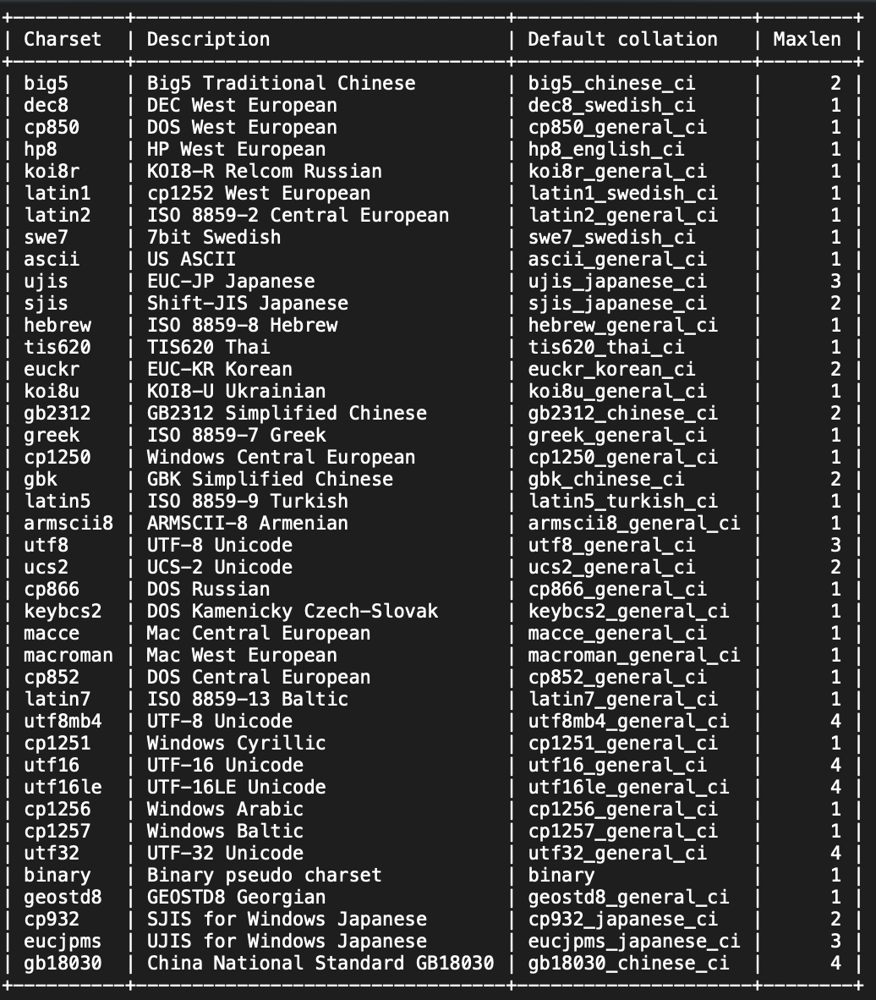
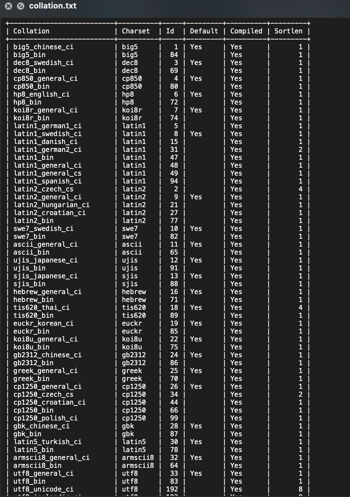
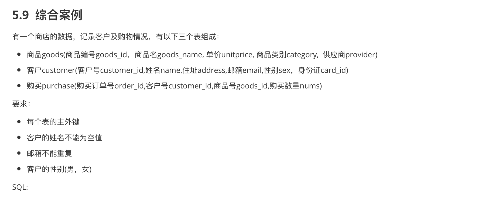
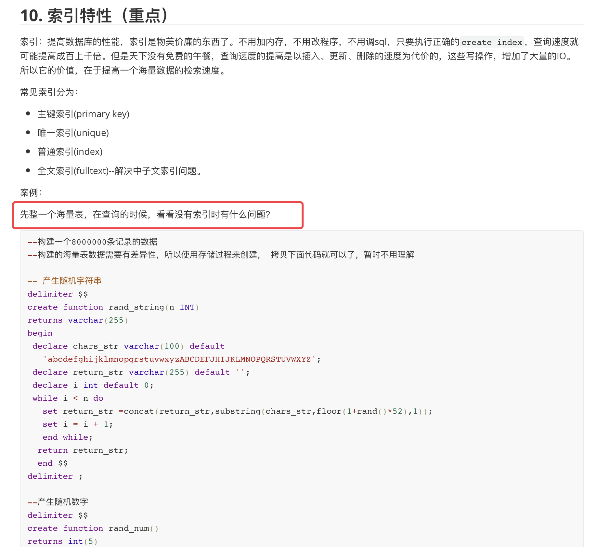
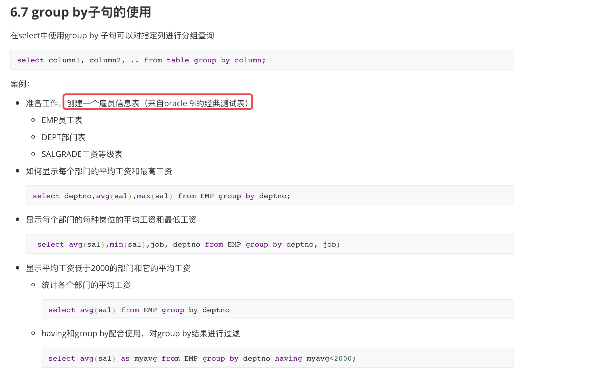
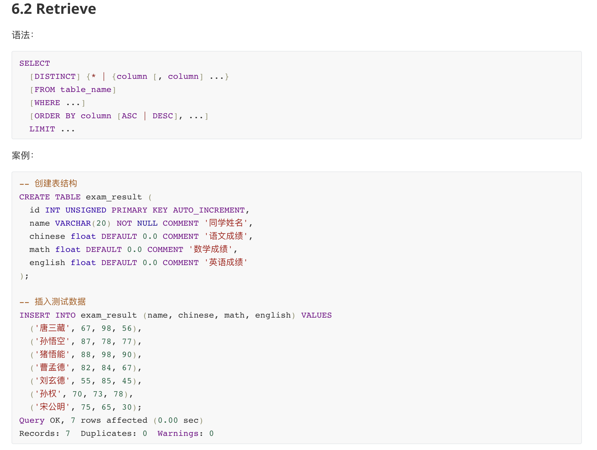

## 字符集对应的文件: charset.txt

## 校对规则对应的文件：collation.txt

## 《05-MySQL表的约束.md》这个章节的最后的习题练习：goods_data.sql 

## 《10-MySQL索引特性.md》 针对索引开篇， 构建海量数据表 ： index_data.sql 

## 《06-MySQL基本查询.md》 创建雇员信息表， 复合查询全章节都会使用到该表

## 《06-MySQL基本查询.md》创建学生信息student_data.sql

